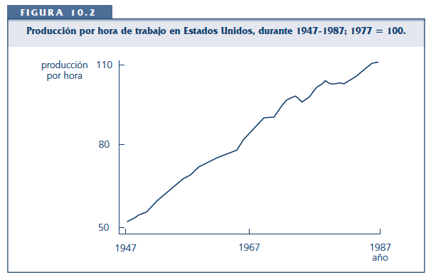
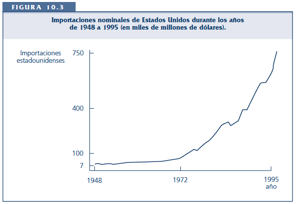

```{r setup, include=FALSE}
library(tufte)
library(knitr)
library(seasonal)
library(readr)
library(writexl)
library(tidyverse)
library(lubridate)
library(purrr)
library(curl)
library(here)
opts_chunk$set(echo = TRUE)
opts_chunk$set(cache.extra = packageVersion('tufte'))
options(htmltools.dir.version = FALSE)
```

# S1: Introducción a las series de tiempo

## 1.1. Datos de la sesión

**Fecha de la sesión:** 
2022-08-29

**Lecturas obligatorias:**

- Wooldridge - Cap. 10.1-10.2
- Bee Dagum & Bianconcini - Cap. 2.1.

## 1.2. Naturaleza de las series de tiempo

Existen 4 estructuras básicas de datos:

```{marginfigure}
**Revisar:** Wooldridge - Cap. 1.3
```

- Datos de corte tranversal: Muestra de unidades tomadas en algún punto dado en el tiempo.

```{r, echo=FALSE}
include_graphics('figures/fig_01_01.png')
```

- Datos de combinación de cortes transversales: Combinación de dos o más muestras de datos de corte transversal.

```{r, echo=FALSE}
include_graphics('figures/fig_01_02.png')
```


- **Datos de series de tiempo**: Observaciones de una o varias variables a lo largo del tiempo.

```{r, echo=FALSE}
include_graphics('figures/fig_01_03.png')
```

- Datos panel: Serie de tiempo por cada unidad de una base de datos de corte transversal.

```{r, echo=FALSE}
include_graphics('figures/fig_01_04.png')
```

Características de las series de tiempo:

```{marginfigure}
**Revisar:** Wooldridge - Cap. 10.1 & 1.3.
```

- Orden temporal: El pasado afecta al futuro.

```{r, echo=FALSE}
include_graphics('figures/fig_01_05.png')
```

- Aleatoriedad en las series de tiempo: Los datos como resultados de variables aleatorias.

```{r, echo=FALSE}
include_graphics('figures/fig_01_06.png')
```

- Periodicidad de los datos: La frecuencia de recolección de la información.

## 1.3. Componentes de las series de tiempo

Los componentes latentes de una serie de tiempo son:

```{marginfigure}
**Revisar:** Bee Dagum & Bianconcini - Cap. 2.1.
```

1. Tendencia ($T$): El valor esperado de largo plazo (tendencia secular).
2. Ciclo ($C$): Movimientos sobrepuestos a lo largo de la tendencia de largo plazo.

3. Estacional ($S$): Movimientos de corto plazo (menos de un año) sistemáticos a lo largo de la serie de tiempo.

4. Irregular ($I$): Componente aleatorio de la serie.

Los componentes pueden ser aditivos o multiplicativos:

- Aditivo: $y_t = T_t + C_t + S_t + I_t$

- Multiplicativo: $y_t = T_t \times C_t \times S_t \times I_t$

Ejemplo con el IMAE de Nicaragua:

```{r warning=FALSE, message=FALSE, cache=TRUE, echo=FALSE} 
nicaragua_ccnn <- read_csv("tables/nicaragua_ccnn.csv")  %>%
  mutate(date = dmy(date))
p <- ggplot(nicaragua_ccnn, mapping = aes(x = date, y = value))
p + geom_line() +
    labs(
    title = "IMAE de Nicaragua",
    x = "Meses", 
    y = "IMAE", 
    caption = "Fuente: BCN.")
```

```{r warning=FALSE, message=FALSE, cache=TRUE, echo=FALSE} 
nicaragua_ccnn_ts <- nicaragua_ccnn %>%
  select(value) %>%
  ts(start=2006, frequency=12) %>% 
  decompose()

plot(nicaragua_ccnn_ts,
    title = "Descomposición (aditiva) del IMAE de Nicaragua",
    xlab = "Meses", 
    ylab = "IMAE") 
```

## 1.4. Modelos de regresión de series de tiempo

Algunos modelos de series de tiempo: 

- Modelos estáticos. Modeliza la relación contemporánea entre las variables.

$y_t = \beta_0 + \beta_1 z_t + u_t, \:t = 1, 2, \,..., n$

- Modelos con rezagos distribuidos finitos (FDL). Modeliza la relación de cuando una o más variables influyen en $y$ en forma rezagada.

```{marginfigure}
Generalizando:$y_t = \alpha_0 + \delta_0 z_t + \delta_1 z_{t-1} + \delta_2 z_{t-2} + \, ... \, + \delta_q z_{t-q} + u_t$
```

$y_t = \alpha_0 + \delta_0 z_t + \delta_1 z_{t-1} + \delta_2 z_{t-2} + u_t, \:t = 1, 2, \,..., n$

Propensión de impacto ($\delta_0$): Cambio inmediato en $y$ debido al aumento de 1 unidad de $z$.

Distribución de rezagos ($\delta_j$):

```{r, echo=FALSE}
include_graphics('figures/fig_01_07.png')
```

Propensión de largo plazo (LRP): El cambio en $y$ debido a un cambio permanente de $z$. Es la suma de los coeficientes de la $z$ actual y sus rezagos ($\delta_0 + \delta_1 + \delta_2$).

# S2: Propiedades de muestras finitas de MCO bajo los supuestos clásicos 

## 2.1. Datos de la sesión

**Fecha de la sesión:** 
2022-08-31

**Lecturas obligatorias:**

- Wooldridge - Cap. 10.3

**Lecturas opcionales:**

- Wooldridge - Cap. 2-4

##  2.2. Insesgamiento de MCO

```{marginfigure}
**Revisar:** Supuestos de la Regresión Lineal Múltiple (RLM) en Wooldridge - Cap. 3.3.
```

**Supuesto ST.1: Lineal en los parámetros**

El proceso estocástico $\{ (x_{t1},\, x_{t2},\, ...,\, x_{tk}, \, y_{t}): \: t = 1, \, 2, \, ..., \, n \}$ sigue el modelo lineal:


$y_t = \beta_0 + \beta_1 x_{t1} + \beta_2 x_{t2} +  \, ... \, + \beta_k x_{tk} + u_t,$

donde $\{u_t: \, t = 1, \, 2, \, ..., \, n\}$ es la secuencia de errores, y $n$ es el número de observaciones.

**Supuesto ST.2: No hay colinealidad perfecta**

En la muestra no hay variables independientes que sean constantes ni que sean una combinación lineal perfecta de las otras.

**Supuesto ST.3: Media condicional cero** 

Para cada $t$, dadas las variables explicativas para todos los periodos, el valor esperado del error $u$, es cero. Matemáticamente:

$\mathsf{E}(u_t | \textbf{X}) = 0, \, t = 1, \, 2, \, ..., \, n.$

**Teorema ST.1: Insesgamiento de los estimadores de MCO**

Bajo los supuestos ST.1, ST.2, y ST.3, los estimadores de MCO son insesgados condicionales sobre $\textbf{X}$, y por tanto también incondicionalmente: $\mathsf{E}(\widehat{\beta}_j)  = \beta_j, \, j = 0, \, 1, \, ..., \, k.$

##  2.3. Teorema Gauss-Markov

```{marginfigure}
**Revisar:** Supuestos de Gauss-Markov en Wooldridge - Cap. 3.4-3.5.
```

**Supuesto ST.4: Homocedasticidad**

La varianza de $u_t$, condicional en $\textbf{X}$, es la misma para cualquier  $t: \, \mathsf{Var}(u_t | \textbf{X}) = \mathsf{Var}(u_t) = \sigma^2, \, t=1, \, 2, \, ..., \, n.$

**Supuesto ST.5: No hay correlación serial**

Los errores, condicionales sobre $\textbf{X}$, en dos periodos distintos, no están correlacionados: $\mathsf{Corr}(u_t, u_s | \textbf{X}) = 0$, para cualquier $t \neq s$.

**Teorema ST.2: Varianzas de muestreo de los estimadores de MCO**

Con base en los supuestos ST.1 y ST.5 de Gauss-Markov para las series de tiempo, la varianza de $\widehat{\beta}_j$, condicional sobre $\textbf{X}$, es:

$\mathsf{Var}(\widehat{\beta}_j | \textbf{X}) = \frac{ \sigma^2}{STC_j (1-R^2_j)}, \, j = 1, \, ...,\, k,$

donde $STC_j$ es la suma total de cuadrados de $x_{tj}$ y $R^2_j$ es la R-cuadrada de la regresión de $x_j$ sobre las otras variables independientes.

**Teorema ST.3: Estimación insesgada de $\sigma^2$**

Bajo los supuestos ST.1 a ST.5, el estimador $\widehat{\sigma^2} = \frac{SRC}{gl}$ es un estimador insesgado $\sigma^2$, donde $gl = n-k-1$.

**Teorema ST.4: Teorema Gauss-Markov**

Bajo los supuestos ST.1 a ST.5, los estimadores de MCO son los mejores estimadores lineales insesgados condicionales sobre $\textbf{X}$.

##  2.4. Inferencia

```{marginfigure}
**Revisar:** Supuestos de distribución de muestreo en Wooldridge - Cap. 4.1.
```

**Supuesto ST.6: Normalidad**

Los errores $u_t$ son independientes de $\textbf{X}$ y son independientes e idénticamente distribuidos como $\mathsf{Normal}(0, \, \sigma^2)$.

**Teorema ST.5: Distribuciones de muestreo normales**

Bajo los supuestos ST.1 a ST.6, los supuestos del MCL para series de tiempo, los estimadores de MCO se distribuyen de forma normal, condicionales sobre $\textbf{X}$.

Bajo la hipótesis nula, cada estadístico $t$ tiene una distribución $t$, y cada estadístico $F$ tiene una distribución $F$. También es válida la construcción usual de los intervalos de confianza.

# S3: Introducción a R

## 3.1. Datos de la sesión

**Fecha de la sesión:** 
2022-09-05

## 3.2. Script

```{marginfigure}
**Tomado de:** Healy, K. (2008). Data Visualization. A practical introduction (https://socviz.co).
```

Les comparto el script de la clase de hoy.

```{r, echo = T, eval = FALSE, error=FALSE, warning=FALSE, message=FALSE}
# Instalacion de paquetes
my_packages <- c("tidyverse", "broom", "coefplot", "cowplot",
                 "gapminder", "GGally", "ggrepel", "ggridges", "gridExtra",
                 "here", "interplot", "margins", "maps", "mapproj",
                 "mapdata", "MASS", "quantreg", "rlang", "scales",
                 "survey", "srvyr", "viridis", "viridisLite", "devtools")

install.packages(my_packages, repos = "http://cran.rstudio.com")

## Uso de librerias
library(devtools)
install_github("kjhealy/socviz")
devtools::install_github("kjhealy/socviz")

# Introduccion
## Librerias
library(tidyverse)
library(socviz)
library(gapminder)

## Objetos
c (1, 2, 3, 1, 3, 5, 25)
my_numbers <- c (1, 2, 3, 1, 3, 5, 25)
your_numbers <- c(5, 31, 29, 4, 89, 43)

my_numbers
your_numbers

## Funciones
### Help
? mean

mean(my_numbers)
mean_my_numbers <- mean(my_numbers)

# Dataframes
titanic
class(titanic)
class(my_numbers)
class(my_packages)
titanic$percent

## Crear un data frame
url <- "https://cdn.rawgit.com/kjhealy/viz-organdata/master/organdonation.csv"
organs <- read_csv(file = url)

# Plots
gapminder
p <- ggplot(data = gapminder,
       mapping  = aes(x = gdpPercap, y = lifeExp))
p + geom_point()
```

# S4: Gráficos y series de tiempo en R

## 4.1. Datos de la sesión

**Fecha de la sesión:** 
2022-09-12

## 4.2. Script

```{r, echo = T, eval = FALSE, error=FALSE, warning=FALSE, message=FALSE}
install.packages("fpp")
install.packages("Ecdat")
install.packages("forecast")


# Librerias ----
library(fpp)
library(forecast)

# Descomposicion de TS aditiva ----
data(ausbeer)
tibble::tibble(data(ausbeer))
ts_beer = tail(head(ausbeer, 17*4+2), 17*4-4)
ts_beer <- as.ts(ts_beer)
plot(ts_beer)

## Tendencia-ciclo ----

trend_beer <- ma(ts_beer, order = 4, centre = T)
trend_beer <- as.ts(trend_beer)
plot(ts_beer)
lines(trend_beer)

## Estacional-irregular ----
detrend_beer <- as.ts(ts_beer - trend_beer)
plot(detrend_beer)

## Estacionalidad promedio ----
seas_beer <-  t(matrix(data = detrend_beer, nrow = 4))
seas_beer <- as.ts(rep(colMeans(seas_beer, na.rm = T), 16))
plot(seas_beer)

## Commando decompose
ts_beer <- ts(ts_beer, frequency = 4)
decompose_beer <- decompose(ts_beer, "additive")
plot(as.ts(decompose_beer$trend))
plot(as.ts(decompose_beer$seasonal))
plot(as.ts(decompose_beer$random))
plot(decompose_beer)

# Descomposicion de TS multiplicativa ----
decompose_beer <- decompose(ts_beer, "multiplicative")
plot(as.ts(decompose_beer$trend))
plot(as.ts(decompose_beer$seasonal))
plot(as.ts(decompose_beer$random))
plot(decompose_beer)
```

# S5: Tendencia y estacionalidad

## 5.1. Datos de la sesión

**Fecha de la sesión:** 
2022-09-25

**Lecturas obligatorias:**

- Wooldridge - Cap. 10.5

## 5.2. Caracterización

**Tendencia lineal:**
Si se mantienen fijos todos los demás factores, $\alpha_1$ mide el cambio en $y_t$ de un periodo al siguiente debido al transcurso del tiempo:

$y_t = \alpha_0 + \alpha_1 t + e_t, \: t = 1, 2, \, ..., k$

Si consideramos que $e_t$, es una secuencia independiente e idénticamente distribuida (i.i.d.), entonces:

$\Delta y_t = y_t - y_{t-1} = \alpha_1$

```{r, echo=FALSE}

```

**Tendencia exponencial:**

Es cuando una serie de tiempo tiene la misma tasa de crecimiento de una período a otro.

$log(y_t) = \beta_0 + \beta_1 t + e_t, \: t = 1, 2, \, ..., k$

$\Delta log(y_t)  = \beta_1$

$\Delta log(y_t) \approx \frac{y_t -  y_{t-1}}{y_{t-1}}$

```{r, echo=FALSE}

```

## 5.3. Regresión espuria

- Pueden existir factores inobservables con tendencia que afectan a $y_t$ que pueden estar correlaciones con las variables explicativas.

- Esto puede derivar en establecer una relación falsa entre $y_t$ y una o más variables explicativas.
 
 - Se debe de incluir la tendencia en el tiempo en el modelo:
 
 $y_t = \beta_0 + \beta_1 x_{t1} + \beta_2 x_{t2} + \beta_3 t + u_t$

- Se debe de incluir una tendencia en la regresión si alguna variable independiente tiene tendencia, incluso si $y_t$ no la tiene.

## 5.4. Regresión en R

```{r, echo = T, eval = FALSE, error=FALSE, warning=FALSE, message=FALSE}

library(fpp)
library(tidyverse)
library(readxl)
library(forecast)

# Wooldridge - Ej. 10.7 (pág. 363)

data_hseinv <- read_csv(url("https://raw.githubusercontent.com/alvarole/econometria2/main/02_data/wooldridge-hseinv.csv"))

data_model <- data_hseinv %>%
  select(year, t, linvpc, lprice)

p <- ggplot(data_model, mapping = aes(x = year, y = linvpc))
p + geom_line()

p <- ggplot(data_model, mapping = aes(x = year, y = lprice))
p + geom_line()

lmodel <- lm(linvpc ~ lprice + year, data = data_model)
summary(lmodel)

lmodel <- lm(linvpc ~ lprice + t, data = data_model)
summary(lmodel)
````