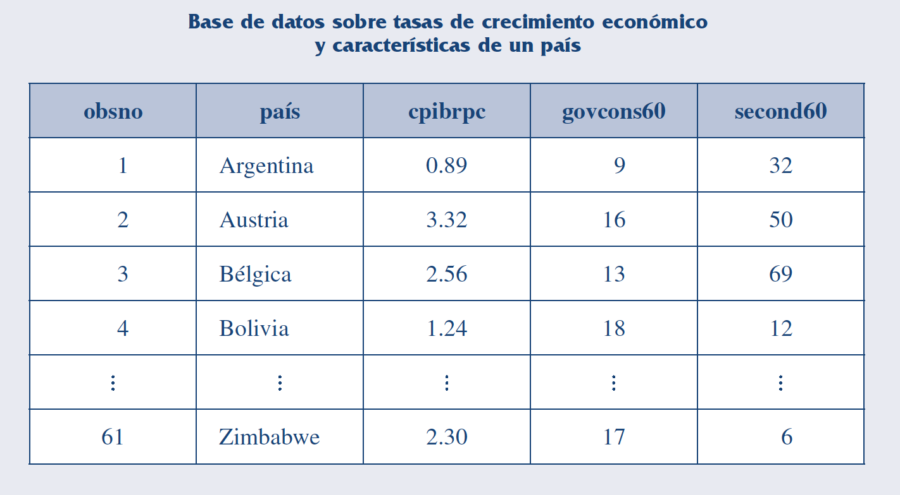
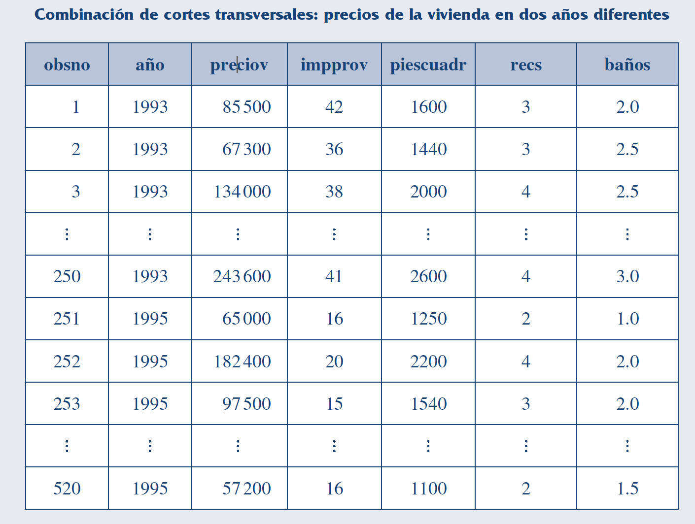
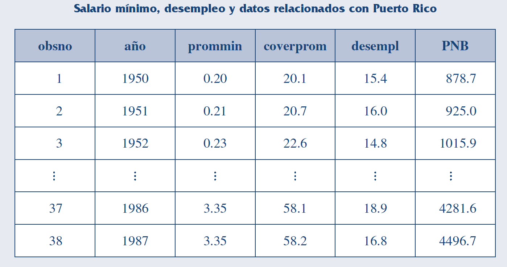
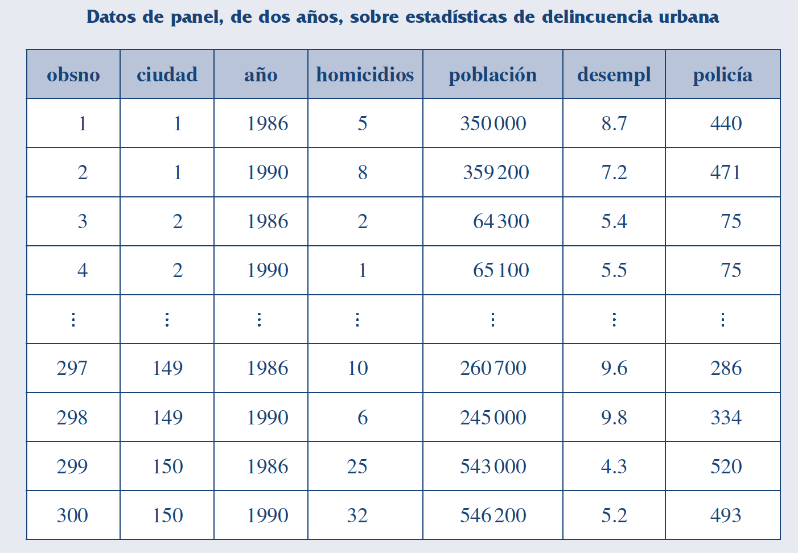
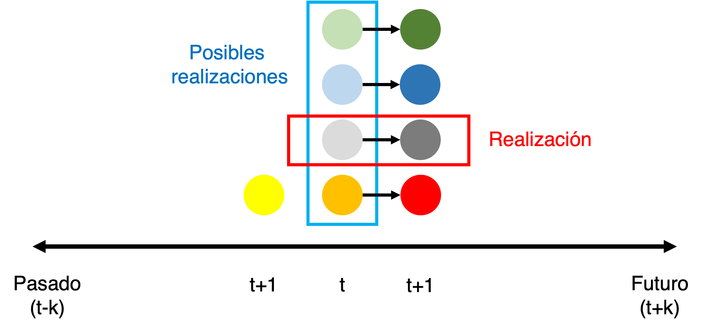
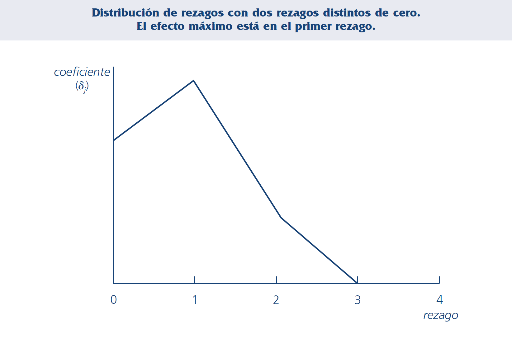

```{r setup, include=FALSE}
library(tufte)
library(knitr)
library(seasonal)
library(readr)
library(writexl)
library(tidyverse)
library(lubridate)
library(purrr)
library(curl)
library(here)
opts_chunk$set(echo = TRUE)
opts_chunk$set(cache.extra = packageVersion('tufte'))
options(htmltools.dir.version = FALSE)
```

# S1: Introducción a las series de tiempo

## 1.1. Datos de la sesión

**Fecha de la sesión:** 
2022-08-29

**Lecturas obligatorias:**

- Wooldridge - Cap. 10.1-10.2
- Bee Dagum & Bianconcini - Cap. 2.1.

## 1.2. Naturaleza de las series de tiempo

Existen 4 estructuras básicas de datos^[**Revisar:** Wooldridge - Cap. 1.3]: 

- Datos de corte tranversal: Muestra de unidades tomadas en algún punto dado en el tiempo.

```{r, echo=FALSE}

```

- Datos de combinación de cortes transversales: Combinación de dos o más muestras de datos de corte transversal.

```{r, echo=FALSE}

```


- **Datos de series de tiempo**: Observaciones de una o varias variables a lo largo del tiempo.

```{r, echo=FALSE}

```

- Datos panel: Serie de tiempo por cada unidad de una base de datos de corte transversal.

```{r, echo=FALSE}

```

Características de las series de tiempo^[**Revisar:** Wooldridge - Cap. 10.1 & 1.3]:

- Orden temporal: El pasado afecta al futuro.

```{r, echo=FALSE}

```

- Aleatoriedad en las series de tiempo: Los datos como resultados de variables aleatorias.

```{r, echo=FALSE}

```

- Periodicidad de los datos: La frecuencia de recolección de la información.

## 1.3. Componentes de las series de tiempo

Los componentes latentes de una serie de tiempo son^[**Revisar:** Bee Dagum & Bianconcini - Cap. 2.1.]:

1. Tendencia ($T$): El valor esperado de largo plazo (tendencia secular).
2. Ciclo ($C$): Movimientos sobrepuestos a lo largo de la tendencia de largo plazo.

3. Estacional ($S$): Movimientos de corto plazo (menos de un año) sistemáticos a lo largo de la serie de tiempo.

4. Irregular ($I$): Componente aleatorio de la serie.

Los componentes pueden ser aditivos o multiplicativos:

- Aditivo: $y_t = T_t + C_t + S_t + I_t$

- Multiplicativo: $y_t = T_t \times C_t \times S_t \times I_t$

Ejemplo con el IMAE de Nicaragua:

```{r warning=FALSE, message=FALSE, cache=TRUE, echo=FALSE} 
nicaragua_ccnn <- read_csv("tables/nicaragua_ccnn.csv")  %>%
  mutate(date = dmy(date))
p <- ggplot(nicaragua_ccnn, mapping = aes(x = date, y = value))
p + geom_line() +
    labs(
    title = "IMAE de Nicaragua",
    x = "Meses", 
    y = "IMAE", 
    caption = "Fuente: BCN.")
```

```{r warning=FALSE, message=FALSE, cache=TRUE, echo=FALSE} 
nicaragua_ccnn_ts <- nicaragua_ccnn %>%
  select(value) %>%
  ts(start=2006, frequency=12) %>% 
  decompose()

plot(nicaragua_ccnn_ts,
    title = "Descomposición (aditiva) del IMAE de Nicaragua",
    xlab = "Meses", 
    ylab = "IMAE") 
```

## 1.4. Modelos de regresión de series de tiempo

Algunos modelos de series de tiempo: 

- Modelos estáticos. Modeliza la relación contemporánea entre las variables.

$y_t = \beta_0 + \beta_1 z_t + u_t, \:t = 1, 2, \,..., n$

- Modelos con rezagos distribuidos finitos (FDL). Modeliza la relación de cuando una o más variables influyen en $y$ en forma rezagada^[Generalizando:$y_t = \alpha_0 + \delta_0 z_t + \delta_1 z_{t-1} + \delta_2 z_{t-2} + \, ... \, + \delta_q z_{t-q} + u_t$] .

$y_t = \alpha_0 + \delta_0 z_t + \delta_1 z_{t-1} + \delta_2 z_{t-2} + u_t, \:t = 1, 2, \,..., n$

Propensión de impacto ($\delta_0$): Cambio inmediato en $y$ debido al aumento de 1 unidad de $z$.

Distribución de rezagos ($\delta_j$):

```{r, echo=FALSE}

```

Propensión de largo plazo (LRP): El cambio en $y$ debido a un cambio permanente de $z$. Es la suma de los coeficientes de la $z$ actual y sus rezagos ($\delta_0 + \delta_1 + \delta_2$).


